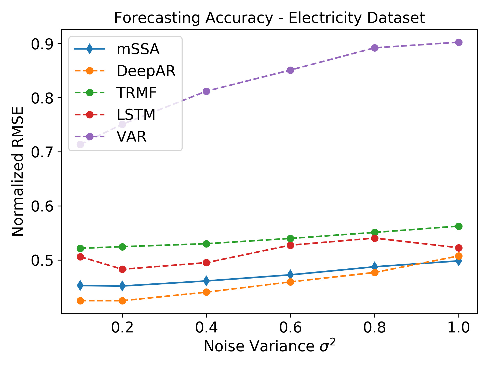

 In this project, we analyze a variant of multivariate singular spectrum analysis (mSSA), a widely used multivariate time series method, which we find to perform competitively with respect to the state-of-art neural network time series methods (LSTM, DeepAR). Its restriction for single time series, singular spectrum analysis (SSA), has been analyzed recently. Despite its popularity, theoretical understanding of mSSA is absent. Towards this, we introduce a natural spatio-temporal factor model to analyze mSSA. 

In this project, we make three technical contributions. First, we establish that the "stacked" Page Matrix time series representation, the core data structure in mSSA (see figure above), has an approximate low-rank structure for a large class of time series models used in practice under the spatio-temporal factor model. Second, we  establish finite-sample bounds for the  in-sample prediction error for both imputation and forecasting. Third, we furnish an algorithm for change point detection that is motivated by this model, and we theortically analyse the trade-offs between false-alarm rate and detection delay.
 

## Resources:
- On Multivariate singular spectrum analysis [paper](/publication/mssa).
- Change Point Detection via Multivariate Singular Spectrum Analysis [paper](/publication/cpd).
- Python implementation of our varaint of mSSA [repository](https://github.com/AbdullahO/mSSA).
